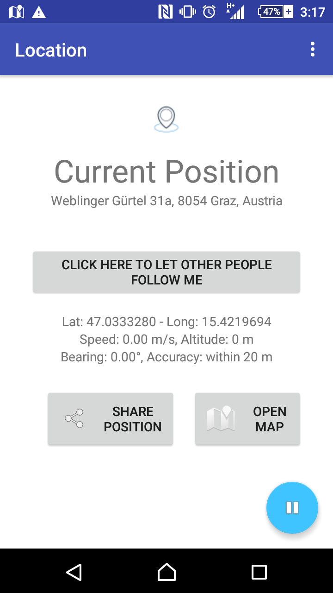
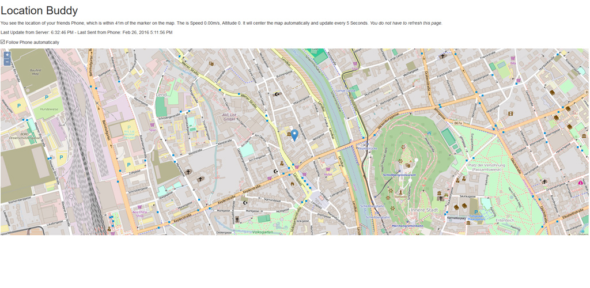

# RefugeeBuddy - Android
The war in the middle east is ongoing and devastating. Millions of people are trying to escape. They often leave their family and friends behind, try to make it on their own to the EU, Ameria, or elsewhere safe. Communication is not always possible with everyone, and tracking apps are not always as easy to use as they should be.

## What does the RefugeeBuddy?
This is an android app which does two things:
1. it makes it _very_ easy to let friends and family members track a phone and know where you are.
2. it has a dedicated war and refugee news aggregation page to keep refugees informed.

## Tracker
Family members and friends are left behind, communication is more than often not very easy. Sometimes weak signals, very low bandwidth or only short availability of signals makes it hard to keep chatting or posting on social networks.

The RefugeeBuddy collects location information and, when a network is available, transfers it to a server, so that friends and family members can see where the person is right now (or was the last time).

### How is that different to all other GPS trackers?
* Open Source: This app is open source, in addition to being free of charge. No ads - so far.
* Low Battery usage: While other apps try to get the location as accurate as possible, here its more meant for saving some battery life. Block-Level accuracy is more than enough. I let this app run the whole day on my phone without any huge impact on battery life.
* No shady things: The source code is openly visible. We don't collect more than necessary. If you feel things should be done in a different way, shoot me an email, make a pull request. I'm happy to change things.

## Background & My Person
Initially I did this, because I was trying to re-learn Java for Android. In mid January 2016 I thought I could write something useful, something with news and maybe a little bit location aware software. I'm the founder of the [newscombinator](http://www.newscombinator.com) and I am working in the finance sector. If this app helps anybody I'm more than happy.

### Refugee News
The news in the app are coming conventiently from my own side project, the [newscombinator smart-filters](http://www.newscombinator.com/smartfilters), which is a news aggregation service where machine learning filters are applied on top of it. You can directly open the news in the [newscombiantor-live-app](http://live.newscombinator.com/#!/96), a foundation-project which is also [open source](https://github.com/tomw1808/newscombinator-live).

### Location Service
The location service was actually the "side" service to the news service, but it turned out that I found it far more important than the news service. 

You can find it [for example here](http://refugeebuddy.newscombinator.com/#/). The frontend is also [open source](https://github.com/tomw1808/LocationTrackerFrontend). 

It is an Angular App with OpenStreetMap Data. The backend is a simple PHP script which writes something to a database (and reads it again from that database). While that is not open source, its really not hard to make it.

## Android App
You can download the Android-App in the [Android Playstore](https://play.google.com/store/apps/details?id=com.vomtom.mytestservice).

### Permissions

    <uses-permission android:name="android.permission.ACCESS_COARSE_LOCATION"/>
    <uses-permission android:name="android.permission.ACCESS_FINE_LOCATION"/>

While the app does not really use the Fine-Location, I have added the permission in order to get the fine location when its needed. If you publish an app in the playstore and add permissions later on, you will need to manually approve the app again in order to receive updates. To avoid that - and for future use - the permission is already added.
    
    <uses-permission android:name="android.permission.INTERNET" />
    <uses-permission android:name="android.permission.ACCESS_NETWORK_STATE" />
    
Those two permissions are pretty self explanatory. The app needs internet access in order to send updates to the server. The app also needs access to the network state in order to know if there is internet access available.
    
    <uses-permission android:name="android.permission.RECEIVE_BOOT_COMPLETED" />
    
This is a good one. Currently the app does not have a settings page, where a user could choose if he wanted to start the tracking server automatically after turning on the phone. I'm planning to integrate this and its also already prepared, but not yet ready.

## License
The source is licensed under GNU General Public License v3.0, which means for you, if you want to use the source code, in short:

Required

* Disclose Source
* License and copyright notice
* Same License
* State Changes

Permitted

* Commercial Use
* Distribution
* Modification
* Patent Use
* Private Use

Forbidden

* Hold Liable

## Questions
If you have any questions, please feel free to contact me at any time. You can either do that by mailing me: thomas [at] newscombinator.com, or chatting with me via the chat-plugin on www.newscombinator.com or open an issue.